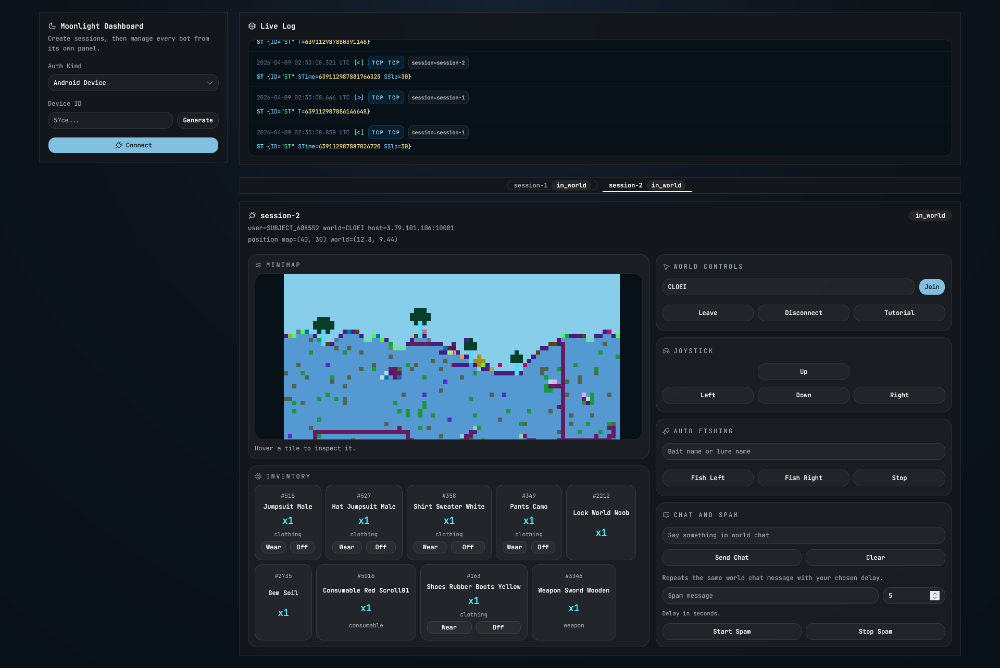

<h1 align="center">Hydro</h1>

<p align="center">An open source PixelWorlds bot — released so the devs finally have a reason to patch it.</p>

## Why I made this public

The developers of this game never gave a damn whether someone could build a fully working bot or not. They had every opportunity to patch these vulnerabilities and they chose to ignore it. So here it is — a complete, working source. It's out in the open now. Patch it. It's not even that hard.

This is not about cheating. This is a challenge to the devs: if a working bot can be built and shared publicly, you have no excuse not to fix it.

## Overview

A Rust-powered backend with a web dashboard frontend for managing multiple PixelWorlds sessions from one place. Includes live logs, session orchestration, world controls, inventory actions, minimap rendering, and gameplay automation.

## Run

```bash
cd web
bun install
bun run build
cd ..
cargo run --bin Hydro
```

Then open `http://127.0.0.1:3000`.

---

## For Developers: How the Bot Works and How to Stop It

This section is written specifically for the PixelWorlds development team. Every vulnerability listed here is confirmed working — not theoretical. The source code in this repo is the proof. Each section explains what the bot does, why it works, and the concrete fix.

---

### 1. Account Creation (The Farming Problem)

**What the bot does:**

Account creation requires no human interaction and no verification. The flow is:

1. Generate a random 40-character hex string as a fake `AndroidDeviceId`
2. `POST https://11ef5c.playfabapi.com/Client/LoginWithDeviceId` with `CreateAccount: true`
3. PlayFab returns a `SessionTicket` — a new account was just created
4. Exchange the ticket at `pw-auth.pw.sclfrst.com/v1/auth/exchangeToken` using a hardcoded API key
5. Receive a game JWT — authentication complete

This can be scripted to create thousands of accounts per hour. No phone number, no email, no CAPTCHA, no rate limit the bot can't bypass.

**How to fix it:**

- **Require email or phone verification** for new accounts before they can enter gameplay. PlayFab supports this natively.
- **Rate-limit account creation per IP** at the PlayFab title level. Unusual bursts of new device IDs from the same IP range should trigger holds.
- **Validate device ID format.** Real Android device IDs follow a specific format. A random 40-char hex string is a red flag.
- **Flag accounts that complete the tutorial at minimum possible time.** Humans take minutes; bots take seconds. PlayFab's event stream makes this measurable.

---

### 2. Hardcoded Secrets in the Binary

**What the bot does:**

Two secrets are extracted directly from the game binary and hardcoded into this source:

- `SOCIALFIRST_API_KEY` — sent as `X-Sf-Client-Api-Key` to exchange PlayFab tickets for game JWTs. Knowing this key is all that's needed to generate valid game sessions without the real client.
- `RELAUNCH_PASS` — sent in every `GPd` (authentication) packet to the game server. This is a static shared password that never changes.

Both are plaintext in the binary. Any tool like `strings` or a decompiler finds them in minutes.

**How to fix it:**

- **Replace `RELAUNCH_PASS` with a per-session challenge-response.** On TCP connect, the server sends a nonce; the client derives the password using a keyed hash of that nonce and a secret embedded in a way that's harder to extract (e.g., split across multiple locations, XORed with runtime values). This won't stop a determined reverse engineer but raises the bar significantly.
- **Rotate `SOCIALFIRST_API_KEY` per client version** and invalidate old keys on server-side when a new build ships. A key that only works for 2 weeks is much less useful than one that works forever.
- **Do not derive auth tokens from static secrets.** Consider short-lived, server-issued challenge tokens tied to device fingerprint.

---

### 3. No Client Integrity Verification

**What the bot does:**

The `VChk` (version check) handshake the bot sends:

```
{ "ID": "VChk", "OS": "WindowsPlayer", "OSt": 3, "sdid": "<device_id>" }
```

The server accepts this from any TCP client. There is no executable hash, no proof-of-work, no attestation that the connecting process is the real game client. This is why an external Rust program can impersonate the game client completely.

**How to fix it:**

- **Include a signed executable hash in `VChk`.** On startup, the client computes a hash of its own binary and signs it with a private key embedded in the game. The server verifies the signature against the expected public key. This is not unbreakable but it forces attackers to patch each new build rather than writing a static bot.
- **Implement runtime attestation.** On mobile/console platforms, use platform-specific attestation (Android Play Integrity API, Apple DeviceCheck). For PC, this is harder, but behavioural signals help.
- **Version-lock the protocol.** The bot currently uses `Unity 6000.3.11f1` in its auth headers because that's the version baked into the binary constants. If the server validates that the Unity version in the auth header matches the expected build version and rejects mismatches, each game update would break any bot that isn't actively maintained.

---

### 4. Unencrypted Protocol

**What the bot does:**

The game communicates over raw TCP using BSON (Binary JSON) with human-readable string packet IDs: `HB`, `HAI`, `mp`, `mP`, `WeOwC`, etc. Packet format was fully reversed using a standard packet sniffer in under one session. The entire protocol is in `src/protocol/mod.rs`.

**How to fix it:**

- **Add TLS to the game server.** This is the single highest-impact change. It prevents passive packet capture and MitM-based protocol reversal. Every major online game does this. The server is already accessible at `game-lava.pixelworlds.pw:10001` — adding TLS is a one-day infrastructure change.
- **Obfuscate packet IDs.** Replace string IDs like `"HB"` with short integers or a hash. This won't stop a determined reverser but it eliminates the instant readability that makes bot development trivial.
- **Add a rolling XOR or session key.** Even a simple session-specific XOR layer on top of BSON forces the reverser to crack the key exchange before reading any traffic.

---

### 5. Client-Authoritative Damage (The Godmode Problem)

**What the bot does:**

When a player takes damage from an AI enemy or a block, the game client:
1. Plays an audio packet (`PPA` with `audioType=100`)
2. Updates HP locally
3. **Never informs the server that damage was taken**

The server does not track player HP and does not send a "you took damage" message. An external bot that simply ignores the client-side damage routines is completely invincible. No packets need to be spoofed or blocked — the bot just doesn't apply the damage.

This was confirmed via packet capture: the only packet sent when taking damage is the audio one.

**How to fix it:**

- **Move HP tracking to the server.** The server should maintain authoritative HP for every player. When an AI enemy hits a player (the server already processes `AIHD` responses), the server should deduct HP and enforce death when HP reaches zero — regardless of what the client says.
- **Send a server-authoritative HP update to the client.** Something like `{ "ID": "HPu", "HP": <value> }` after each damage event. The client should render this value, not its own local calculation.
- **Enforce death server-side.** If the server decides a player is dead, it should disconnect them and refuse `HB`/`HAI` packets until a respawn is acknowledged.

---

### 6. No Server-Side Movement Validation

**What the bot does:**

Movement is sent as two packets in one batch:
- `mp` — binary-encoded map coordinates (target tile)
- `mP` — world-space coordinates + timestamp + animation + direction

The server accepts any tile coordinates without validating whether the movement from the previous position is physically possible. The bot pathfinds and then teleports one tile at a time by sending `mp`+`mP` at whatever speed it wants.

**How to fix it:**

- **Track last acknowledged position server-side per player.** On each `mp`/`mP` pair, verify that the claimed new position is reachable from the last known position given the elapsed time and the player's maximum speed.
- **Enforce a minimum time between movement packets.** Players have a maximum walk speed. Accepting movement updates faster than that speed allows is the core of bot movement.
- **Reject out-of-bounds or through-wall movement.** The server has the world tile data. It should validate that the path between old and new position doesn't cross impassable tiles.

---

### 7. No Mining Rate Limiting

**What the bot does:**

Mining is a single `HB` packet (`{ "ID": "HB", "x": <tile_x>, "y": <tile_y> }`). The bot sends this at 350ms intervals — roughly 3x faster than a human. BMod (the internal mod this was inspired by) mines at 220ms per hit.

The server accepts these without checking the rate, tool tier, or time since the last hit on that tile.

**How to fix it:**

- **Track last `HB` timestamp per (player, tile) on the server.** Each tool tier has a minimum hit interval. Reject hits that arrive before the minimum interval has elapsed.
- **Track total `HB` packets per player per second.** A player sending more than 4–5 per second is almost certainly a bot. Log, flag, and kick anomalous rates.
- **Require the player to be adjacent to the tile.** Validate that `HB` coordinates are within 1–2 tiles of the player's last known server-side position.

---

### Summary Table

| Vulnerability | Difficulty to exploit | Difficulty to fix | Impact |
|---|---|---|---|
| Account farming (random device ID) | Trivial | Easy | Critical — infinite free accounts |
| Hardcoded API key + relaunch password | Trivial | Medium | High — anyone can auth without the real client |
| No client integrity check | Easy | Hard | High — any external program can be the "client" |
| Unencrypted BSON protocol | Easy | Easy (TLS) | High — full protocol readable via packet capture |
| Client-authoritative HP / godmode | Trivial | Medium | High — bots are permanently invincible |
| No movement validation | Easy | Medium | Medium — bots teleport freely |
| No mining rate limit | Trivial | Easy | Medium — bots mine 3x faster than humans |

---

## Note

This is for educational and patch-reference purposes only. No AC bypass is included. Use it to understand the vulnerabilities — and if you're a dev, use it to fix them.

Contributions are welcome. If you find something else worth patching, open a PR.
# hydrapw
# hydrapw
# hydro
